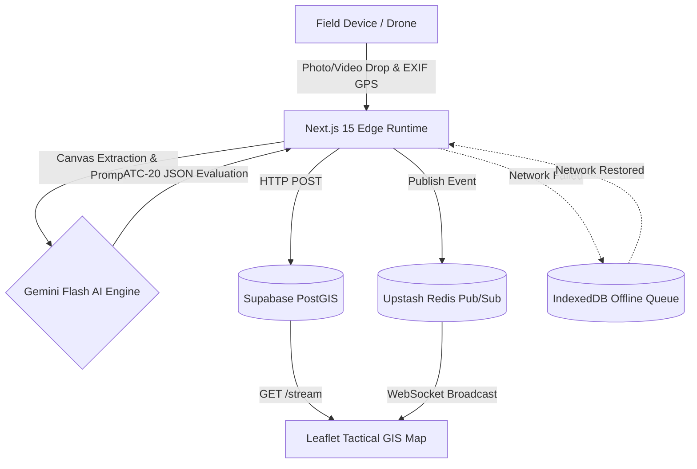

<div align="center">
  <h1>AegisStructure (ResQ-Vision)</h1>
  <p><b>Enterprise First-Responder Tactical AI & GIS Structural Triage Platform</b></p>
  <p>
    <b>Problem Statement:</b> <code>[PSN002]</code> AI-Powered Structural Stability Assessment<br/>
    <b>Standard Compliance:</b> FEMA P-154 (Rapid Visual Screening) & ATC-20 (Post-Earthquake Safety Evaluation of Buildings)<br/>
    <b>Target:</b> Bit N Build '26 Grand Finale (Mumbai)
  </p>
</div>

---

## 1. Executive Operational Overview & Problem Context

**The Disaster-Site Dilemma**
In the catastrophic aftermath of a high-magnitude seismic event, urban bombing, or major structural failure, a city may face upwards of 10,000 compromised structures. Incident Command operates in the dark: there are zero accessible CAD blueprints, communications are crippled, and there is a critical shortage of licensed structural engineers. 

**The Failure of Traditional Workflows**
Traditional civil engineering workflows—relying on clipboards, physical transit levels, and manual load calculations—are dangerously slow. During the critical "Golden 6 Hours" of urban collapse, rescue teams (NDRF/USAR) cannot afford to wait 45 minutes for a structural engineer to clear a building for entry. Responders must know instantly whether a partially collapsed building is a safe staging zone or an imminent death trap.

**The AegisStructure Solution**
AegisStructure is *not* an ultrasonic laboratory simulator. It is an **enterprise-grade rapid visual triage and dynamic perimeter exclusion platform** engineered for the mud, dust, and chaos of Ground Zero. By allowing any drone operator or first responder to instantly snap a photo and transmit it, AegisStructure weaponizes multimodal AI to execute rapid ATC-20 mathematical assessments in seconds, broadcasting theoretical collapse radiuses to a live tactical map across the entire operational theater.

---

## 2. Core SDE-3 Architectural Innovations

*   **Multimodal Vision Keyframe Extraction:** A zero-dependency client-side pipeline utilizing an offscreen HTML5 `<video>` and `<canvas>` engine to rip exact 1.0s timestamp keyframes as base64 strings. This completely circumvents serverless API payload limits and Vercel body-size bottlenecks.
*   **Deterministic ATC-20 Triage Engine:** Enforces rigid `SchemaType.OBJECT` JSON generation to deterministically classify structural states into strict **Green Inspected**, **Yellow Restricted**, and **Red Unsafe** placards.
*   **2.5D Dynamic Exclusion Geofencing & Egress Routing:** Mathematically computes kinetic collapse perimeters and draws dynamic, pulsating SVG geofences and animated safe-egress polylines on the tactical map.
*   **Resilient Offline-First Sync:** Utilizes `idb-keyval` (IndexedDB) to securely spool assessment payloads locally when operating in zero-connectivity subterranean or tunnel disaster zones, instantly delta-syncing to Command upon re-establishing network connection.
*   **Real-time Sub-millisecond Spatial Streaming:** Leverages a globally distributed Upstash Redis Pub/Sub backplane layered over Supabase PostGIS for instantaneous fleet-wide tactical map updates.
*   **Web Audio Tactical Klaxon:** Taps directly into the browser's native Web Audio API (synthetic hardware-level oscillator) to generate a piercing two-tone (880Hz -> 440Hz) squelch alert whenever a `RED_UNSAFE` diagnosis is transmitted.
*   **ATAK / QGIS Interoperable GeoJSON:** Exports live theater data into standard RFC 7946 GeoJSON FeatureCollections, ensuring immediate interoperability with military Android Team Awareness Kit (ATAK) and QGIS platforms.

---

## 3. Governing Mathematical & Civil Engineering Formulations

AegisStructure drives AI reasoning through proven civil engineering heuristics.

### Residual Capacity Ratio (RCR) Model
The structural viability of a building is estimated via the Residual Capacity Ratio:

$$RCR = 1.0 - \sum_{i=1}^{n} (w_i \cdot \delta_i)$$

*   $w_i$ represents the severity weighting coefficient assigned to specific failure phenotypes.
*   $\delta_i$ represents the detected occurrence of critical defects, including diagonal shear cracking ($45^\circ$ X-cracking in masonry), longitudinal rebar buckling, concrete core spalling, and out-of-plumb tilt exceeding 3 degrees.

### Dynamic Debris Collapse Radius
When an imminent collapse (`RED_UNSAFE`) is triggered, the engine calculates the theoretical exclusion zone:

$$R_{\text{collapse}} = 1.5 \cdot H_{\text{structure}} \cdot \sin(\theta_{\text{tilt}}) + \Delta_{\text{safety}}$$

This calculates the horizontal displacement threat caused by the P-Delta ($\Delta$) instability regime. The $1.5$ multiplier accounts for lateral debris scatter upon impact, while $\Delta_{\text{safety}}$ guarantees a minimum 10-meter operational standoff ring.

---

## 4. Production Architecture & Data Flow Diagram



---

## 5. AI Safety & Human-in-the-Loop (HITL) Governance

Defense-grade systems cannot rely on autonomous AI for final life-safety authority. AegisStructure implements rigorous fail-safes:
*   **Incident Commander Override:** The platform provides a manual override control within the Tactical Map and Placard Modal. Authorized personnel can downgrade an AI-generated `RED_UNSAFE` flag to `YELLOW_RESTRICTED` or `GREEN_INSPECTED` by supplying their Engineer Badge ID and a documented justification (e.g., "Field audit confirms hairline crack is non-structural plaster spalling only").
*   **Diagnostic Confidence Gauge & Fallback Alerts:** The visual assessment engine returns a real-time `confidence_score`. If optical diagnostic confidence drops below 75%, the HUD flashes an amber warning banner: `⚠️ LOW OPTICAL CONFIDENCE (<75%): SECONDARY STRUCTURAL VALIDATION REQUIRED — ENTRY RESTRICTED`.

---

## 6. Zero-Bandwidth Offline Mesh Architecture

During total cellular/infrastructure collapse, the AegisStructure Edge application caches critical telemetry locally.
*   **Field Mesh Buffer:** An IndexedDB pipeline captures high-resolution imagery, metadata, and triage telemetry.
*   **Tactical HUD Pill:** A visual queue in the mission telemetry header informs the operator of the mesh status (`● 0 QUEUED (ONLINE)` vs `▲ [N] PENDING SYNC`).
*   **Delta-Sync Upstream:** Upon establishing a Starlink, SATCOM, or restored cellular uplink, the operator can force-flush the buffer queue upstream, delivering the queued payloads instantly to the command node without data loss.

---

## 7. Technology Stack Matrix

| Layer | Technology | Provider | Architectural Responsibility |
|-------|------------|----------|------------------------------|
| **Frontend Framework** | Next.js 15 (App Router) | Vercel | React Server Components & Edge routing |
| **UI & Styling** | Tailwind CSS & Lucide | Open Source | Dark-mode tactical interface & SVG iconography |
| **GIS Mapping** | Leaflet & React-Leaflet | Carto / OSM | Map rendering, dynamic SVGs, and GeoJSON egress |
| **AI Reasoning** | Gemini Flash Models | Google DeepMind | Visual defect extraction & ATC-20 math estimation |
| **Persistence** | PostGIS (PostgreSQL) | Supabase | Relational and geospatial data persistence |
| **Real-time Eventing**| Redis | Upstash | Sub-millisecond Pub/Sub for fleet-wide map updates |
| **Offline Cache** | IndexedDB (`idb-keyval`) | Web API | Local payload queuing in disconnected zones |
| **Hardware Audio** | Web Audio API | Web API | Synthetic hardware oscillator for klaxon alerts |

---

## 8. API Contracts & Database Schemas

### Core REST Endpoints
*   `POST /api/assess/vision`: Accepts a base64 image string, latitude, longitude, and building name. Pipes data to Gemini with strict schema formatting. Returns the payload including the newly integrated `confidence_score`.
*   `POST /api/assess/save`: Inserts the structured payload into Postgres.
*   `POST /api/assess/update`: Endpoint to process the HITL Commander Override and update the placard state with `override_badge_id` and `override_justification`.
*   `GET /api/assess/stream`: Rapidly fetches the top 50 descending assessments from Postgres to hydrate the client map on initial load.


### Supabase Relational Schema
**Table:** `public.structural_assessments`
```sql
id UUID PRIMARY KEY DEFAULT uuid_generate_v4(),
building_name VARCHAR(50),
latitude DOUBLE PRECISION,
longitude DOUBLE PRECISION,
placard_status VARCHAR(20), -- GREEN_INSPECTED, YELLOW_RESTRICTED, RED_UNSAFE
residual_capacity_score NUMERIC,
tilt_degrees NUMERIC,
collapse_radius_meters NUMERIC,
structural_archetype VARCHAR(50),
detected_defects JSONB,
incident_action_plan TEXT,
created_at TIMESTAMP WITH TIME ZONE DEFAULT NOW()
```

### Redis Key Topography
*   `channel:tactical-alerts` (Pub/Sub Channel): Broadcasts live geographic events to the frontend.
*   `recent_assessments` (List): An `LPUSH`/`LTRIM` cached array of the latest 50 incident IDs.

---

## 7. Local Setup, Environment Variables & Verification Guide

### Prerequisites
*   Node.js `>= 20.x`
*   Valid API keys for Supabase, Upstash Redis, and Google Gemini.

### Installation & Execution
```bash
# 1. Clone the repository and install dependencies
npm install

# 2. Configure environment variables
cp .env.example .env.local
# Populate with NEXT_PUBLIC_SUPABASE_URL, SUPABASE_SERVICE_ROLE_KEY, UPSTASH_REDIS_REST_URL, UPSTASH_REDIS_REST_TOKEN, and GEMINI_API_KEY.

# 3. Compile the enterprise build
npm run build

# 4. Launch the local dev server
npm run dev
```

### Verification & Testing (For Judges)
1. Navigate to `http://localhost:3000`.
2. First-time visitors will automatically receive the **Interactive Mission Briefing** modal.
3. Click the **"⚡ Launch Interactive Simulation"** CTA inside the modal.
4. **Sector 4 Disaster Cluster Simulation:** The system will immediately bypass manual entry and pin 3 realistic, AI-evaluated buildings directly onto the tactical map around your location.
5. Watch as the RED pin pulses with its exclusion geofence, and the emergency Web Audio Klaxon fires. 
6. Click the pins to view the popups, then test the **Export Mission GeoJSON** extraction button.

---

## 8. Verification & Validation Audit

A rigorous zero-mercy system hardening and QA audit has been executed. 
Capabilities verified include:
- Global EXIF Geotag Ingestion (dynamically panning to the parsed coordinates).
- Client-side `<video>` to `<canvas>` Keyframe Extraction.
- Strict ATC-20 nomenclature and iconography validation, including the exact staging icon (Lucide Crosshair in tactical cyan) and egress routing geometry.

For detailed test execution records, telemetry coordinate validations, and headless browser proofs, please see the [Test Audit Report](logs/TEST_AUDIT_REPORT.md).
